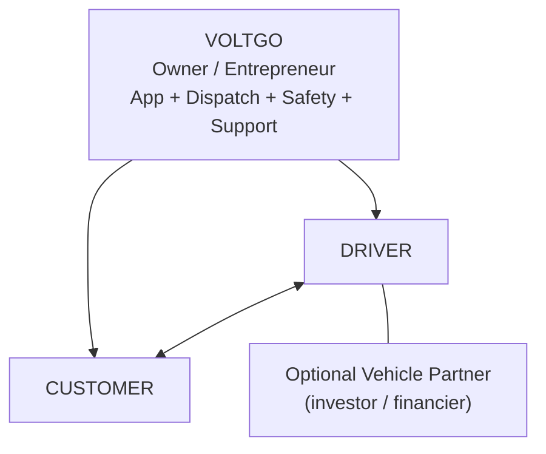
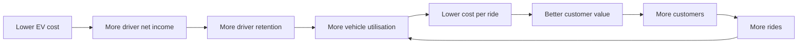
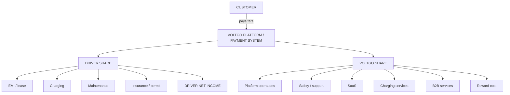

# ⚡ VoltGo vs Ola — Business Model, Gap Analysis, Economics & Pricing

> **VoltGo** is an all-electric ride-hailing platform that keeps driver costs low, keeps customer pricing transparent, rewards customers on every ride, and builds its business around EV charging, financing and fleet services.

| | |
|---|---|
| **Prepared** | 6 October 2026 |
| **Level** | 2nd Year B.Tech Project |
| **Pilot city** | Noida, Uttar Pradesh |
| **Currency** | Indian Rupees (Rs) |
| **Final USP** | *Better EV economics + better driver experience + customer rewards* |

---

## 📑 Table of Contents

1. [How to Read This Report](#1-how-to-read-this-report)
2. [The VoltGo Model in Simple Words](#2-the-voltgo-model-in-simple-words)
3. [Competitive Landscape: Ola and Others](#3-competitive-landscape-ola-and-others)
4. [What Broke in the Old VoltGo Model](#4-what-broke-in-the-old-voltgo-model)
5. [Final Pricing Model](#5-final-pricing-model)
6. [Unit Economics](#6-unit-economics)
7. [Vehicle-Partner Models](#7-vehicle-partner-models)
8. [EV vs CNG Analysis](#8-ev-vs-cng-analysis)
9. [Energy, Charging & Battery Swapping](#9-energy-charging--battery-swapping)
10. [Regulation, Subsidy & Tax Checks](#10-regulation-subsidy--tax-checks)
11. [Go-to-Market Strategy](#11-go-to-market-strategy)
12. [Pilot Plan, KPIs & Kill Criteria](#12-pilot-plan-kpis--kill-criteria)
13. [SWOT Analysis](#13-swot-analysis)
14. [Flywheel & Money Flow](#14-flywheel--money-flow)
15. [Key Numbers at a Glance](#15-key-numbers-at-a-glance)
16. [Presentation-Safe Statements](#16-presentation-safe-statements)
17. [Conclusion](#17-conclusion)
18. [Sources](#18-sources)

---

## 1. How to Read This Report

The report is written in simple language so it can be used directly in a college presentation or viva.

| Tag | Meaning |
|---|---|
| **FACT** | Information taken from a cited source |
| **MODEL** | Our own example or calculation — must be tested with real Noida data |
| **FIX** | Our proposed improvement to the VoltGo model |
| **LEGAL CHECK** | Must be confirmed by a lawyer / CA before commercial launch |

---

## 2. The VoltGo Model in Simple Words

> **VoltGo = EV ride-hailing + better driver economics + charging/finance support + customer rewards.**

### 2.1 The four roles

| Role | Who they are |
|---|---|
| **Owner / Entrepreneur** | VoltGo founder / VoltGo company |
| **Driver** | Person who accepts and drives the ride |
| **Customer** | Person who books and takes the ride |
| **Vehicle Partner** | *Optional* person/company that owns or finances the EV |

> **Note:** The word "Owner" caused confusion in the old triangle. In the main model, **Owner = the VoltGo entrepreneur/company**. If someone else owns the e-auto, call them **Vehicle Partner / Investor**.



### 2.2 Who gets what?

| Role | Gets |
|---|---|
| **VoltGo** | Platform revenue, SaaS revenue, charging/service revenue, corporate mobility revenue, later advertising/sponsorship |
| **Driver** | Fare income, EV operating-cost advantage, incentives where applicable, transparent earnings statement, charging access, finance/lease support |
| **Customer** | EV ride, transparent fare, ride tracking, safety support, reward points, selected off-peak savings |
| **Vehicle Partner** | Lease/rental income where applicable, digital vehicle tracking, maintenance records, battery-health data |

---

## 3. Competitive Landscape: Ola and Others

### 3.1 Positioning — what *not* to say

- ❌ *"Ola is a monopoly."*
- ✅ *"Ola is a major established competitor, but it faces competition from Rapido, Uber, Bharat Taxi and other mobility platforms."*
- ❌ *"Zero commission is unique to VoltGo."* — Ola already announced a zero-commission pass. 📎 [NDTV Profit](https://www.ndtvprofit.com/business/ola-drivers-can-now-avail-zero-commission-if-they-pay-rs-2010-a-month)
- Competitors named: **Rapido, Uber** (zero-commission auto model — 📎 [Reuters](https://www.reuters.com/world/india/uber-adopts-smaller-rivals-model-india-autorickshaw-rides-weather-competition-2025-02-18/)), **Bharat Taxi** (📎 [New Indian Express](https://www.newindianexpress.com/amp/story/states/delhi/2025/Dec/18/bharat-taxi-to-roll-out-from-january-1-56000-drivers-onboard))

### 3.2 Ola driver pricing — `FACT`

📎 **Sources:** [NDTV Profit](https://www.ndtvprofit.com/business/ola-drivers-can-now-avail-zero-commission-if-they-pay-rs-2010-a-month) · [Times of India — flat-fee discussion](https://timesofindia.indiatimes.com/business/india-business/as-commissions-fall-flat-fee-reshapes-ride-hailing/articleshow/122029891.cms) · [Ola driver app](https://play.google.com/store/apps/details?hl=en-IN&id=com.olacabs.oladriver)

| Item | Value |
|---|---|
| Daily pass | **Rs 67/day** |
| Monthly (30 days) | **Rs 2,010/month** |

**Meaning:** A busy driver may like this because, after paying the pass, the driver keeps the ride earnings. A low-demand driver still pays the fixed fee.

**VoltGo FIX:**
- Pilot fee = Rs 0–49/day
- Later target ≈ Rs 60–67/day maximum
- Temporary waiver for new drivers
- Earn more from SaaS / charging / B2B services

> The fee must be tested with real ride numbers.

### 3.3 Ola FY25 financials — `FACT`

📎 **Source:** [Inc42 — Ola Consumer FY25](https://inc42.com/buzz/ola-consumers-loss-doubles-to-%E2%82%B9662-4-cr-in-fy25/) *(the Rs 1.74 and −48.93% figures came from another source in the earlier analysis)*

| Metric | Reported |
|---|---|
| Operating revenue | Fell ~41.8% to **Rs 1,170.9 crore** |
| Net loss | Doubled to ~**Rs 662.4 crore** |
| Spend per Rs 1 of operating revenue | ~Rs 1.74 *(earlier analysis)* |
| EBITDA margin | ~ −48.93% *(earlier analysis)* |

These are **company-level** numbers, not per-ride profit/loss.

**Lesson for VoltGo:** Do not assume a ride-hailing app becomes profitable simply by getting lots of bookings.

### 3.4 Fairwork (driver welfare)

Fairwork evaluates platform work on **fair pay, fair conditions, fair contracts, fair management and fair representation**. The cited Fairwork India material gave Ola and Uber very low/zero scores in that framework.

📎 **Sources:** [Fairwork reports](https://fairwork.oii.ox.ac.uk/en/fw/fairwork-reports/) · [Fairwork India 2024 summary](https://ruralindiaonline.org/library/resource/fairwork-india-ratings-2024-labour-standards-in-the-platform-economy) · [Fairwork publications](https://fairwork.oii.ox.ac.uk/en/fw/publications/)

**VoltGo FIX — a simple daily earnings statement:**

```
  Gross fare
− VoltGo fee
− Charging cost
− EMI / lease
− Incentives / other deductions
= NET EARNINGS
```

---

## 4. What Broke in the Old VoltGo Model

| # | Old idea | Problem |
|---|---|---|
| 1 | **20% commission** | At Rs 1,190/day fare → Rs 238/day, vs Ola's Rs 67/day. Driver pays **Rs 171/day extra** — VoltGo becomes *worse* for the driver. |
| 2 | **5% customer reward points** | At Rs 1,190/day = Rs 59.50/day — too large for a thin-margin startup. |
| 3 | **60/20/20 split** (Driver / Vehicle Owner / VoltGo) | Not automatically legal. UP rules distinguish driver-owned vs aggregator-owned vehicles; third-party owner structure needs legal review. |
| 4 | **150 km/day on one battery** | Needs charging or battery swapping — can't be assumed without planning. |
| 5 | **"EV is automatically 20–30% cheaper for the passenger"** | Not always true — the fare must also cover driver, vehicle, EMI, charging, maintenance, insurance, battery replacement, platform cost, safety/compliance and taxes. |

---

## 5. Final Pricing Model

### 5.1 Driver payment model

| Stage | Driver access fee |
|---|---|
| **Pilot** | Rs 0–49/day |
| **Long-term target** | Around Rs 60–67/day maximum (subject to pilot economics) |

**Optional paid services:** charging/swap access · insurance add-on · maintenance package · vehicle lease.

**Why:** Simpler for drivers than a high percentage commission.

> ⚠️ Do **not** call it "zero commission" if VoltGo still charges service/access fees. Better wording: **"Low and capped driver access fee."**

### 5.2 Customer pricing — three levels

| Level | Description |
|---|---|
| **1. Normal Fare** | Around the applicable local/base fare |
| **2. Green Saver** | Small discount during off-peak hours, low-demand zones, or periods of high EV availability |
| **3. Reward Price** | Customer redeems accumulated points on a future VoltGo trip |

Safer than making every ride permanently cheap.

### 5.3 Customer reward economics

- **Base reward: ~1% of eligible fare** (e.g. Rs 500 ride → ~Rs 5; at Rs 1,190/day → Rs 11.90/day)
- Old 5% model → Rs 59.50/day. **1% is much safer for the pilot.**

**Suggested rules:**
- Redeem only on VoltGo rides
- No cash-out, no transfer, no selling, no buying
- No chance-based rewards
- Redemption cap ~20–30% of future fare
- Expiry period

> **LEGAL CHECK:** CA/lawyer to review GST, consumer-protection and RBI/PPI implications. Use a **closed-loop points system**.
>
> 📎 [RBI PPI framework](https://www.rbi.org.in/Scripts/NotificationUser.aspx/NotificationUser.aspx?Id=12156)

### 5.4 Revenue streams — "Earn around the vehicle, not only from the fare"

| # | Stream | Notes |
|---|---|---|
| 1 | Driver access fee | ≤ Rs 67/day at scale |
| 2 | Vehicle-partner SaaS | e.g. Rs 900/month/vehicle (Rs 30/day): tracking, battery-health report, maintenance reminders, earnings dashboard, digital documents |
| 3 | Charging / battery service margin | e.g. Rs 2/kWh × 12 kWh = Rs 24/day |
| 4 | Corporate mobility | Monthly ride packages for offices, universities, hospitals, industrial parks |
| 5 | Advertising / sponsorship | Only after scale |
| 6 | Finance / insurance referral | Only where legally and commercially suitable |

---

## 6. Unit Economics

> 🔶 **All figures in this section are MODEL numbers, not guarantees.**

### 6.1 Base driver assumptions

📎 *Source: the supplied VoltGo unit-economics analysis (internal model — no external link).*

| Assumption | Value |
|---|---|
| Paid km/day | 85 |
| Rides/day | 17 (avg 5 km paid) |
| Fare | Rs 14 per paid km |
| **Daily gross fare** | **85 × 14 = Rs 1,190** |
| E-auto on-road price | Rs 3.5 lakh |
| Loan | 80% = Rs 2.8 lakh @ 14% p.a., 48 months |
| **Estimated EMI** | **≈ Rs 7,650/month** |
| Electricity | Rs 9/kWh at 0.10 kWh/km |
| Maintenance | Rs 0.45/km |
| Dead-km share | 30% |
| Battery reserve | Rs 75,000 per 1.5 lakh km (= Rs 0.50/km) |
| Insurance + permit | ≈ Rs 57/day |
| Platform variable cost | Rs 4.5/ride |
| Customer points | 1% |
| Operating days | 300/year |

### 6.2 Driver net income by fee model

| # | Model | Daily fee | Driver net after EMI |
|---|---|---|---|
| 1 | Ola flat fee | Rs 67 | ≈ Rs 535/day |
| 2 | VoltGo 20% commission | Rs 238 | ≈ Rs 364/day |
| 3 | VoltGo 8%, capped at Rs 90 | Rs 90 | ≈ Rs 512/day |
| 4 | VoltGo 8%/Rs 90 **+ BaaS** | Rs 90 | ≈ Rs 660/day *(rough; assumes lower vehicle cost and ~Rs 1.3/km all-in swap cost)* |

### 6.3 Commission-cap mathematics

```
8% × fare = Rs 90   →   fare = 90 / 0.08 = Rs 1,125
```

- Below Rs 1,125 daily fare → 8% applies
- Above Rs 1,125 → fee stops at Rs 90

This gives drivers a strong incentive to keep working because the fee stops rising after the cap. *(Final fee must still be checked against current regulatory and tax structure.)*

### 6.4 VoltGo revenue engine — two versions

| Line item (Rs/day/vehicle) | Old higher-margin model | **Final driver-friendly model** |
|---|---|---|
| Driver fee | 90 (8% capped) | **67** (flat access fee) |
| Vehicle SaaS | 30 | **30** |
| Charging / BaaS margin | 24 | **24** |
| Finance referral | 3.5 | — |
| **Total revenue** | **≈ 147.5** | **121** |
| Platform variable cost (17 × 4.5) | −76.5 | −76.5 |
| Customer points (1% × 1,190) | −11.9 | −11.9 |
| **Contribution** | **≈ 59.1** | **≈ 32.6** |

The lower contribution is acceptable because drivers keep more money and the model is more competitive — but VoltGo now needs **stronger SaaS / charging / B2B revenue**.

> **Key question:** *Can VoltGo earn enough from services around the vehicle to keep the driver fee low?* The target is **yes**, but the pilot must prove it.

### 6.5 Break-even — two different estimates

| Model | Contribution/day | Fixed corporate cost | Break-even vehicles |
|---|---|---|---|
| Earlier model | ≈ Rs 59 | Rs 15–20 lakh/month | ~850–1,130 |
| **Driver-friendly model** | ≈ Rs 32.6 (= Rs 978/vehicle/month) | Rs 15 lakh/month | **≈ 1,534** |
| **Driver-friendly model** | ≈ Rs 32.6 | Rs 20 lakh/month | **≈ 2,045** |

> ⚠️ Do **not** present "850–1,130 vehicles" as a fixed fact. Recalculate break-even after pilot data.

---

## 7. Vehicle-Partner Models

| Model | How it works | Illustrative numbers (MODEL) | Best for |
|---|---|---|---|
| **A. Driver owns vehicle** | Driver earns fare, pays EMI, charging, maintenance, insurance/permit, battery reserve. VoltGo earns platform fee with lower asset risk. | — | **Asset-light pilot** |
| **B. Vehicle partner owns vehicle** | Partner buys/finances the e-auto and leases it to the driver. | Driver net ≈ Rs 608/day · Lease ≈ Rs 328/day · VoltGo fee ≈ Rs 90/day · Partner yield ≈ ~18% (after insurance + battery costs) | Drivers who need a vehicle |
| **C. Old 60/20/20** | 60% Driver / 20% Owner / 20% VoltGo | At Rs 1,190/day: Driver ≈ Rs 550, Owner ≈ Rs 120 (~10% yield), VoltGo ≈ Rs 238. At Rs 2,000/day: Driver ≈ Rs 1,048, Owner ≈ Rs 282 (~24%), VoltGo ≈ Rs 400 | ❌ **Removed from main pitch** |

**Notes**
- Model B: fixed-rent structure must be checked against driver-share rules and tax/GST treatment. **Do not promise "18% guaranteed return."**
- Model C: the Rs 2,000/day case needs much higher utilisation and is not a normal base case.

📎 **Driver-share rules referenced:** [MoRTH Aggregator Guidelines 2025](https://morth.nic.in/sites/default/files/circulars_document/MV-Aggregators-Guidelines-2025%20-%20English%20and%20Hindi.pdf) · [Parliament answer / driver-share material](https://sansad.in/getFile/loksabhaquestions/annex/186/AU2016_YnA7gP.pdf?source=pqals) · [UP Aggregator Rules 2026](https://upidadv.up.gov.in/upload/PublicationRequest/183241/SachivalyaLKO130326Notification639090236220551079.pdf)

---

## 8. EV vs CNG Analysis

> There are **two kinds of numbers** here: **(A)** published research (CEEW, WRI, ICCT, EVreporter) and **(B)** our own model. **Do not mix them.**

### 8.1 Published research — `FACT`

| Study | Finding | Simple meaning | 📎 Source |
|---|---|---|---|
| **CEEW** (TCO) | EV 3W ≈ **Rs 1.28/km** vs CNG 3W ≈ **Rs 2.35/km** | A well-used electric 3W can be cheaper over its life — but VoltGo won't automatically save exactly Rs 1.07/km. | [CEEW TCO](https://www.ceew.in/publications/cost-of-ownership-for-road-transport-sector-for-different-vehicle-segments-fuels-and-powertrains) |
| **WRI India** | High utilisation improves the economic case for e-3Ws | The more useful km per day, the easier to recover the higher purchase price. | [WRI 3W business case](https://wri-india.org/perspectives/busting-cost-barrier-why-electric-three-wheelers-make-business-sense) · [WRI EV TCO](https://wri-india.org/perspectives/total-cost-ownership-electric-vehicles-implications-policy-and-purchase-decisions) · [WRI e-auto guidebook](https://wri-india.org/sites/default/files/E-auto-guidebook_WRI-India.pdf) · [WRI 3W opportunities](https://wri-india.org/perspectives/electrification-3-wheeler-cargo-segment-india-potential-challenges) |
| **ICCT** | Financing is a major part of EV ownership cost | Loan interest can reduce the advantage of cheap electricity. | [ICCT](https://theicct.org/sites/default/files/publications/update-electrifying-india-ride-hailing-fleet-apr2021.pdf) |
| **EVreporter** | Example microfinance first-loan cap ≈ Rs 75,000 | Access to finance can matter more than fuel cost. | [EVreporter](https://evreporter.com/financing-models-for-electric-three-wheelers/) |

Actual savings depend on: vehicle price, loan rate, electricity tariff, CNG price, km/day, dead km, battery cost, maintenance, utilisation.

### 8.2 Our model assumptions

| Item | Value |
|---|---|
| EV e-auto on-road price | Rs 3.5 lakh |
| Reference ICE/CNG-style auto | ~Rs 2.2 lakh |
| EV price premium | ~Rs 1.3 lakh (≈ 59% higher) |
| CNG running cost (base) | Rs 2.5/km |
| Other inputs | Same as [§6.1](#61-base-driver-assumptions) |

### 8.3 Sensitivity — EV net saving vs CNG (Rs/day) · `MODEL`

| Scenario | 80 km | 100 km | 120 km | 140 km |
|---|---:|---:|---:|---:|
| **Base** (14% loan, Rs 9/kWh, CNG Rs 2.5/km) | −23 | +2 | +28 | +54 |
| EV price premium reduced to 35% | +28 | +54 | +80 | +106 |
| Cheaper loan at 10% | −15 | +10 | +36 | +62 |
| Electricity at Rs 7/kWh | −7 | +22 | +52 | +82 |
| CNG at Rs 3/km | +17 | +52 | +88 | +124 |
| Battery reserve Rs 0.30/km | −7 | +22 | +52 | +82 |
| **All favourable assumptions** | +105 | +149 | +193 | +236 |

**Simple lesson at 100 km/day:** base ≈ +Rs 2 · lower EV premium ≈ +Rs 54 · cheaper electricity ≈ +Rs 22 · all favourable ≈ +Rs 149.

> **EV is NOT automatically a huge profit machine.** Biggest drivers: **(1) vehicle price, (2) loan interest, (3) electricity price, (4) daily km, (5) dead km.**

---

## 9. Energy, Charging & Battery Swapping

### 9.1 Why 150 km/day needs energy planning

Using a Mahindra Treo-type example: battery ≈ **10.24 kWh**, real-world range ≈ **110–120 km**. A 150 km day needs roughly **12–15 kWh**. → Don't assume 150 km on one charge with no downtime. Possible solution: **Battery Swapping / Battery-as-a-Service (BaaS).**

### 9.2 Battery swapping — CEEW 2026

- Reduces charging downtime and separates battery ownership from the vehicle
- Battery can be ~40–50% of upfront EV cost in some examples
- Swap time ~1–3 minutes in suitable systems

📎 **Source:** [CEEW — Battery swapping 2026](https://www.ceew.in/publications/challenges-and-benefits-of-battery-swapping-system-policies-for-electric-vehicle-transition-india)

**VoltGo must first confirm:** compatible vehicle · compatible battery · actual station availability · actual price per swap/kWh · partner contract.

> ⚠️ Do **not** promise "3-minute Noida swapping" until a partner is actually signed.

### 9.3 Noida charging / swap references

Possible partnership **targets** (not guaranteed infrastructure): [**Battery Smart**](https://www.batterysmart.in/), [**Mooving**](https://www.mooving.com/), [**Yuma Energy**](https://yuma.energy/news/yumainnoida/), and a Noida Authority + HPCL plan involving 13 EV battery-swapping stations. Station availability was *not* treated as verified for VoltGo.

---

## 10. Regulation, Subsidy & Tax Checks

> **LEGAL CHECK** — everything in this section needs a written legal/CA opinion before launch.

### 10.1 UP Aggregator Rules 2026 — `FACT`

📎 **Sources:** [Official UP Rules 2026 (primary)](https://upidadv.up.gov.in/upload/PublicationRequest/183241/SachivalyaLKO130326Notification639090236220551079.pdf) · [Argus summary](https://www.argus-p.com/updates/updates/overview-of-the-uttar-pradesh-motor-vehicle-thirty-third-amendment-aggregator-and-delivery-services-provider-rules-2026/) · [ANI summary](https://aninews.in/news/national/general-news/app-based-ride-bookings-in-up-to-face-stricter-regulation-yogi-government-keeping-a-close-watch-on-fares20260822013333/)

| Item | Requirement |
|---|---|
| Application fee | Rs 25,000 |
| Licence fee | Rs 5,00,000 |
| Security deposit | Rs 10,00,000 (up to 1,000 other motor vehicles) |
| Driver share — driver-owned vehicle | ≥ **80%** of applicable fare |
| Driver share — aggregator-owned vehicle | ≥ **60%** of applicable fare |
| Dynamic fare range | 50%–150% of base fare |
| Unjustified driver cancellation | 10% of fare, max Rs 100 |
| Customer cancellation | 10% of fare, max Rs 100 (subject to applicable rule) |
| Support | 24×7 support / control room required |

**On 60/20/20** (📎 [MoRTH Guidelines 2025](https://morth.nic.in/sites/default/files/circulars_document/MV-Aggregators-Guidelines-2025%20-%20English%20and%20Hindi.pdf)): Don't say *"60/20/20 is definitely legal."* Say: *"Driver share and vehicle-partner payment will be designed after legal review of the exact ownership and contract structure."*

### 10.2 EV subsidies

| Scheme | Detail | Treatment |
|---|---|---|
| **UP EV Policy 2022** ([source](https://invest.up.gov.in/uttar-pradesh-electric-vehicle-manufacturing-policy-2022/)) | e-3W capital subsidy: 15% of ex-factory cost, capped at Rs 12,000 · e-2W capped at Rs 5,000 · 100% road-tax & registration-fee exemption for eligible EVs · eligibility tied to vehicles made/assembled in UP | Don't depend on it; verify current validity |
| **PM E-DRIVE (central)** ([PM E-DRIVE](https://pmedrive.heavyindustries.gov.in/) · [PIB](https://www.pib.gov.in/PressReleasePage.aspx?PRID=2290696&lang=1&reg=48) · [policy docs](https://pmedrive.heavyindustries.gov.in/policy_document)) | L5 e-3W support closed after 26 December 2025 | **Base model assumes no central L5 purchase subsidy** |

### 10.3 Tax / depreciation

- Do **not** market a "40% EV depreciation shield" as fact.
- Income-tax Act 2025 moved the section reference from Section 32 → **Section 34** from 1 April 2026; sources disagree on a separate EV depreciation rate.
- Ask a CA for the exact rate/treatment. Tax benefit only helps if the owner has taxable income.
- 📎 [TaxGuru — Section 34 discussion](https://taxguru.in/income-tax/depreciation-income-tax-act-2025-section-34-rates-provisions.html)

### 10.4 GST / loyalty / payments

- GST treatment of subscription/access-fee models must be checked. 📎 [CBIC GST rates](https://cbic-gst.gov.in/hindi/gst-goods-services-rates.html) · [CBIC GST FAQ](https://cbic-gst.gov.in/hindi/sectoral-faq.html) · [Reverse-charge list](https://cbic-gst.gov.in/pdf/List%20of%20Services%20under%20reverse%20charge.pdf)
- **Final rule:** closed-loop points system + written legal/tax advice. 📎 [RBI PPI framework](https://www.rbi.org.in/Scripts/NotificationUser.aspx/NotificationUser.aspx?Id=12156)

---

## 11. Go-to-Market Strategy

### 11.1 Start with e-autos, not everything

**Do NOT** launch e-bikes + e-rickshaws + e-autos + cars on day one. **Start with e-autos / e-3Ws** because they offer:

- strong high-utilisation use case
- simpler pilot
- easier charging planning
- easier route/corridor control
- easier unit-economics measurement

Add e-2Ws and cars only after the first model works. Bike taxis are separate (state-level permissions differ). 📎 [MoRTH Guidelines 2025](https://morth.nic.in/sites/default/files/circulars_document/MV-Aggregators-Guidelines-2025%20-%20English%20and%20Hindi.pdf)

### 11.2 Asset-light strategy

**Do NOT buy 300 vehicles immediately** — 300 × Rs 3.5 lakh = **Rs 10.5 crore**, before financing, insurance, charging, maintenance, battery replacement, admin and idle-vehicle risk. BluSmart is the cautionary example of a fleet-heavy EV model. 📎 [Reuters](https://www.reuters.com/business/autos-transportation/indias-electric-cab-service-blusmart-suspends-operations-after-co-founder-probed-2025-04-17/) · [BluSmart/WRI report](https://www.blu-smart.com/assets/ev-report.pdf) · [Indian Express](https://indianexpress.com/article/business/blusmart-new-business-models-legal-hurdles-behind-churn-india-ride-hailing-market-9952865/)

**FIX:**
- Driver-owned EVs where possible
- Vehicle-partner-owned EVs for drivers who need vehicles
- Very few VoltGo-owned vehicles (demo/testing only)

### 11.3 How VoltGo can counter Ola

**Ola's advantages:** existing customer base · large driver network · strong brand · mature app and operations. VoltGo should **not** fight all of these at once.

| # | Lever | How |
|---|---|---|
| 1 | EV-only focus | Optimise dispatch and operations for EVs |
| 2 | Driver economics | Low/capped access fee |
| 3 | EV financing | Connect drivers to banks/NBFCs/vehicle partners |
| 4 | Charging support | Make energy access part of the product |
| 5 | Battery health | Track health and maintenance digitally |
| 6 | Customer rewards | 1% base rewards instead of an expensive 5% promise |
| 7 | High-density operations | Start with small Noida corridors |
| 8 | Corporate bookings | Office/university/hospital contracts → predictable demand |
| 9 | Transparent net earnings | Drivers see what they actually take home |
| 10 | Safety + support | Built in from day one |

> **Goal:** Not *"destroy Ola everywhere"* — but *"become the best EV mobility option in a small, high-density Noida corridor."*

### 11.4 The most important lever: density

A vehicle far from the customer means dead km → electricity cost, time loss, lower driver earnings, higher cost per ride. **Don't start by reducing fare — first reduce dead km.**

**Start with:** metro feeder routes · office/IT clusters · university/hostel clusters · residential-to-metro routes · hospital clusters.

**Track:** paid km/day · total km/day · dead km % · rides/day · avg pickup distance · avg pickup time · rides/hour.

---

## 12. Pilot Plan, KPIs & Kill Criteria

### 12.1 Phases

| Phase | Fleet size |
|---|---|
| **Phase 1** | 50–100 e-autos |
| **Phase 2** | 150–300 — *only if the pilot works* |

### 12.2 12-week plan

| Weeks | Focus |
|---|---|
| **1–4** | Legal/compliance setup · licence work · driver onboarding · charging partner · select 2–3 corridors · app testing |
| **5–8** | Soft launch · test access fee · test points · test charging · track driver net income |
| **9–12** | Improve dispatch · reduce dead km · test corporate rides · test charging revenue · test SaaS · **decide whether to scale** |

### 12.3 Pilot KPIs

| Area | KPIs |
|---|---|
| **Driver** | Net income after vehicle costs · 7-day & 30-day retention · paid km/day · total km/day · earnings/hour · cancellation rate |
| **Customer** | Repeat booking rate · customer acquisition cost · average rating · cancellation rate · avg pickup time · points redemption rate |
| **Business** | Revenue/vehicle/day · variable cost/ride · contribution/vehicle/day · SaaS revenue · charging revenue · B2B revenue · support cost |
| **EV** | kWh/km · charging downtime · battery utilisation · battery degradation · charging cost/km |

### 12.4 Kill / repair criteria

After ~8 weeks, **repair or stop** if:

1. Paid km stays below ~70 km/day
2. Driver net income stays below target
3. Repeat customers are too low
4. Charging causes major lost work hours
5. Contribution remains negative
6. Driver acquisition cost is too high
7. Cancellation remains too high

*Update exact thresholds with real pilot data.*

---

## 13. SWOT Analysis

| ✅ Strengths | ⚠️ Weaknesses |
|---|---|
| 100% EV positioning | High EV purchase price |
| Customer rewards | Charging dependence |
| Low/capped driver fee | Battery degradation/replacement |
| Charging + finance support | Low starting network density |
| EV-focused operations | Small launch customer base |
| Transparent driver earnings | High compliance cost |
| Strong potential 3W TCO at high utilisation | Thin margin when driver fee is low |

| 🚀 Opportunities | 🔻 Threats |
|---|---|
| EV adoption | Ola already has a zero-commission/flat-fee model |
| Charging partnerships | Rapido and Uber compete strongly |
| Vehicle finance partnerships | Bharat Taxi adds another model |
| Corporate mobility | Competitors can expand EV fleets |
| Battery swapping | Charging delays reduce driver earnings |
| Fleet-management software | Regulation can change |
| Expansion after pilot proof | Asset-heavy scaling can hurt cash flow |

---

## 14. Flywheel & Money Flow

### 14.1 Can VoltGo make rides cheaper without making drivers poorer?

**Yes — but not just because EV electricity is cheap.** The correct chain:



VoltGo earns from **SaaS + charging + B2B**; customers get rewards/off-peak savings → more repeat customers → higher utilisation.

### 14.2 Final business model table

| Role | Main job | Main benefit |
|---|---|---|
| Entrepreneur | Runs VoltGo platform | Platform/service revenue |
| Driver | Drives and completes rides | Fare income + EV savings |
| Customer | Books and pays | Ride + safety + rewards |
| Vehicle Partner | Owns/finances EV | Lease/asset return |

### 14.3 Final money flow



### 14.4 Final USP

- **Full version:** *"VoltGo is an all-electric ride-hailing platform that keeps driver costs low, keeps customer pricing transparent, rewards customers on every ride, and builds its business around EV charging, financing and fleet services."*
- **Presentation version:** *"Better EV economics + better driver experience + customer rewards."*
- **NOT:** ~~"Cheapest ride in India."~~

---

## 15. Key Numbers at a Glance

| Category | Number |
|---|---|
| Ola driver pass | Rs 67/day · Rs 2,010/month |
| Old VoltGo 20% commission | Rs 238/day at Rs 1,190 fare |
| Old VoltGo 8% capped fee | Rs 90/day max (cap reached at Rs 1,125 daily fare) |
| **Recommended VoltGo pilot fee** | **Rs 0–49/day** |
| **Long-term fee target** | **~Rs 60–67/day** |
| Customer base points | 1% (old 5% = Rs 59.50/day) |
| E-auto price / reference CNG auto | Rs 3.5 lakh / Rs 2.2 lakh |
| EV loan | Rs 2.8 lakh · 14% · 48 months · EMI ≈ Rs 7,650/month |
| Fare / base paid km / rides | Rs 14 per km · 85 km/day · 17 rides/day |
| Base daily fare | Rs 1,190 |
| Platform variable cost | Rs 4.5/ride (Rs 76.5/day) |
| SaaS | Rs 900/month (Rs 30/day) |
| Charging margin example | Rs 2/kWh × 12 kWh = Rs 24/day |
| Finance referral example | ~Rs 3.5/day |
| Contribution — earlier / new | ~Rs 59.1/day → ~Rs 32.6/day |
| Illustrative vehicle-partner lease | Rs 328/day |
| UP application / licence / deposit | Rs 25,000 / Rs 5,00,000 / Rs 10,00,000 |
| UP dynamic fare range | 50%–150% of base fare |
| Cancellation penalty | 10%, max Rs 100 |
| CEEW TCO — EV vs CNG 3W | ~Rs 1.28/km vs ~Rs 2.35/km |
| EV battery / real-world range | ~10.24 kWh / ~110–120 km |
| 150 km energy need | ~12–15 kWh |
| Battery swap time | ~1–3 minutes (suitable systems) |
| Battery share of upfront EV cost | ~40–50% in some examples |

---

## 16. Presentation-Safe Statements

### ✅ SAY

- "Ola already has a flat-fee/zero-commission driver model."
- "VoltGo's differentiation is not zero commission alone."
- "VoltGo focuses on EV economics, charging, financing, transparent earnings and customer rewards."
- "EV 3-wheelers can have lower TCO, especially at good utilisation."
- "VoltGo will start with e-autos in a small Noida pilot."
- "We will use real ride and cost data before scaling."
- "Customer discounts will be used only when the economics allow them."
- "Driver and vehicle-owner payment structures will be legally reviewed."

### ❌ DO NOT SAY

- "Ola is a monopoly."
- "Ola currently takes 20% from every driver."
- "Zero commission is unique to VoltGo."
- "EV is always 23% cheaper than CNG."
- "Every ride will be 30% cheaper."
- "Zero cancellations are guaranteed."
- "60/20/20 is definitely legal."
- "Government subsidy will pay for the fleet."
- "Noida already has confirmed VoltGo battery swapping."
- "VoltGo will buy 300 vehicles on day one."
- "VoltGo will definitely break even at 850–1,130 vehicles."

---

## 17. Conclusion

**Core offer:** EV mobility + better driver economics + charging/finance support + customer rewards.

**Core pricing**
- Pilot driver fee = **Rs 0–49/day**
- Scale target = **~Rs 60–67/day**
- Customer rewards = **~1%**
- Fare = around the legally applicable local/base fare first

**Core economic strategy**

| ❌ Don't | ✅ Do |
|---|---|
| Take 20% of every ride | Improve utilisation |
| Depend on 5% rewards | Reduce dead km |
| Depend on huge EV subsidies | Lower driver cost |
| Buy a huge fleet at the start | Add SaaS, charging services and corporate bookings |
| | Keep customer rewards affordable |
| | Scale only after the pilot proves the numbers |

> **The biggest business lesson:**
> *"Do not try to make every ride dramatically cheaper. Make every vehicle more productive and every stakeholder more valuable."*

---

## 18. Sources

Every source is also linked inline next to the claim it supports. Full list, side by side with where it is used:

| Category | Source | Used for | Section |
|---|---|---|---|
| **UP regulation** | [Official UP Aggregator Rules 2026](https://upidadv.up.gov.in/upload/PublicationRequest/183241/SachivalyaLKO130326Notification639090236220551079.pdf) | Fees, deposit, driver share, dynamic fares, cancellation | [§10.1](#101-up-aggregator-rules-2026--fact) |
| | [Argus summary](https://www.argus-p.com/updates/updates/overview-of-the-uttar-pradesh-motor-vehicle-thirty-third-amendment-aggregator-and-delivery-services-provider-rules-2026/) | Rules overview | §10.1 |
| | [ANI summary](https://aninews.in/news/national/general-news/app-based-ride-bookings-in-up-to-face-stricter-regulation-yogi-government-keeping-a-close-watch-on-fares20260822013333/) | Rules / fare monitoring | §10.1 |
| **Central guidelines** | [MoRTH MV Aggregator Guidelines 2025](https://morth.nic.in/sites/default/files/circulars_document/MV-Aggregators-Guidelines-2025%20-%20English%20and%20Hindi.pdf) | Driver share, bike taxis, 60/20/20 check | §7, §10.1, §11.1 |
| | [Parliament / driver-share material](https://sansad.in/getFile/loksabhaquestions/annex/186/AU2016_YnA7gP.pdf?source=pqals) | Driver-share rules | §7 |
| **Ola / competitors** | [NDTV Profit — Ola Rs 67/day](https://www.ndtvprofit.com/business/ola-drivers-can-now-avail-zero-commission-if-they-pay-rs-2010-a-month) | Ola zero-commission pass | §3.1, §3.2 |
| | [Times of India — flat-fee discussion](https://timesofindia.indiatimes.com/business/india-business/as-commissions-fall-flat-fee-reshapes-ride-hailing/articleshow/122029891.cms) | Flat-fee trend | §3.2 |
| | [Ola driver app](https://play.google.com/store/apps/details?hl=en-IN&id=com.olacabs.oladriver) | Ola driver product | §3.2 |
| | [Inc42 — Ola FY25](https://inc42.com/buzz/ola-consumers-loss-doubles-to-%E2%82%B9662-4-cr-in-fy25/) | Revenue and net loss | §3.3 |
| | [Reuters — Uber zero-commission autos](https://www.reuters.com/world/india/uber-adopts-smaller-rivals-model-india-autorickshaw-rides-weather-competition-2025-02-18/) | Uber model | §3.1 |
| | [New Indian Express — Bharat Taxi](https://www.newindianexpress.com/amp/story/states/delhi/2025/Dec/18/bharat-taxi-to-roll-out-from-january-1-56000-drivers-onboard) | Bharat Taxi | §3.1 |
| **EV economics** | [CEEW TCO](https://www.ceew.in/publications/cost-of-ownership-for-road-transport-sector-for-different-vehicle-segments-fuels-and-powertrains) | EV vs CNG Rs/km | §8.1 |
| | [WRI EV TCO](https://wri-india.org/perspectives/total-cost-ownership-electric-vehicles-implications-policy-and-purchase-decisions) | Utilisation and TCO | §8.1 |
| | [WRI 3W business case](https://wri-india.org/perspectives/busting-cost-barrier-why-electric-three-wheelers-make-business-sense) | Utilisation and TCO | §8.1 |
| | [WRI e-auto guidebook](https://wri-india.org/sites/default/files/E-auto-guidebook_WRI-India.pdf) | e-auto reference | §8.1 |
| | [WRI 3W opportunities](https://wri-india.org/perspectives/electrification-3-wheeler-cargo-segment-india-potential-challenges) | e-3W potential | §8.1 |
| | [ICCT](https://theicct.org/sites/default/files/publications/update-electrifying-india-ride-hailing-fleet-apr2021.pdf) | Financing cost | §8.1 |
| | [EVreporter](https://evreporter.com/financing-models-for-electric-three-wheelers/) | Microfinance loan cap | §8.1 |
| **Battery / charging** | [CEEW battery swapping 2026](https://www.ceew.in/publications/challenges-and-benefits-of-battery-swapping-system-policies-for-electric-vehicle-transition-india) | Swap time, battery share of cost | §9.2 |
| | [Battery Smart](https://www.batterysmart.in/) | Partnership target | §9.3 |
| | [Mooving](https://www.mooving.com/) | Partnership target | §9.3 |
| | [Yuma Noida](https://yuma.energy/news/yumainnoida/) | Partnership target | §9.3 |
| **EV incentives** | [UP EV Policy 2022](https://invest.up.gov.in/uttar-pradesh-electric-vehicle-manufacturing-policy-2022/) | State subsidy and exemptions | §10.2 |
| | [PM E-DRIVE](https://pmedrive.heavyindustries.gov.in/) | Central scheme | §10.2 |
| | [PM E-DRIVE policy documents](https://pmedrive.heavyindustries.gov.in/policy_document) | Central scheme | §10.2 |
| | [PIB — L5 incentive status](https://www.pib.gov.in/PressReleasePage.aspx?PRID=2290696&lang=1&reg=48) | L5 support closure | §10.2 |
| **Driver welfare** | [Fairwork reports](https://fairwork.oii.ox.ac.uk/en/fw/fairwork-reports/) | Fairwork framework | §3.4 |
| | [Fairwork India 2024 summary](https://ruralindiaonline.org/library/resource/fairwork-india-ratings-2024-labour-standards-in-the-platform-economy) | Ola/Uber ratings | §3.4 |
| | [Fairwork publications](https://fairwork.oii.ox.ac.uk/en/fw/publications/) | Fairwork background | §3.4 |
| **GST / RBI** | [CBIC GST rates](https://cbic-gst.gov.in/hindi/gst-goods-services-rates.html) | Subscription/access-fee GST | §10.4 |
| | [CBIC GST FAQ](https://cbic-gst.gov.in/hindi/sectoral-faq.html) | GST FAQ | §10.4 |
| | [Reverse-charge list](https://cbic-gst.gov.in/pdf/List%20of%20Services%20under%20reverse%20charge.pdf) | Reverse-charge services | §10.4 |
| | [RBI PPI framework](https://www.rbi.org.in/Scripts/NotificationUser.aspx/NotificationUser.aspx?Id=12156) | Points / loyalty rules | §5.3, §10.4 |
| **Asset-heavy EV model** | [Reuters — BluSmart](https://www.reuters.com/business/autos-transportation/indias-electric-cab-service-blusmart-suspends-operations-after-co-founder-probed-2025-04-17/) | Fleet-heavy risk | §11.2 |
| | [BluSmart / WRI case](https://www.blu-smart.com/assets/ev-report.pdf) | Fleet-heavy case study | §11.2 |
| | [Indian Express — BluSmart](https://indianexpress.com/article/business/blusmart-new-business-models-legal-hurdles-behind-churn-india-ride-hailing-market-9952865/) | Business-model challenges | §11.2 |
| **Tax / depreciation** | [TaxGuru — Section 34](https://taxguru.in/income-tax/depreciation-income-tax-act-2025-section-34-rates-provisions.html) | EV depreciation caveat | §10.3 |

---

## ⚖️ Disclaimer

This is a 2nd-year B.Tech project report. All **MODEL** figures are illustrative and must be validated with real Noida pilot data. Regulatory, tax, GST and RBI/PPI points are flagged **LEGAL CHECK** and must be confirmed by a qualified lawyer/CA before any commercial launch.
